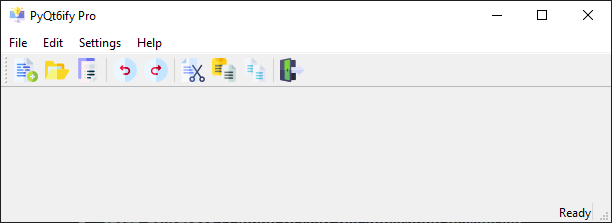
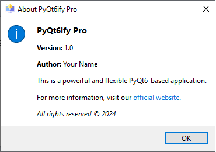

## PyQt6ify Pro

**PyQt6ify Pro** is a robust starter kit designed to simplify the development of desktop applications using **PyQt6**. It offers a modular, ready-to-use framework with essential features such as customizable menus, toolbars, status bars, integrated logging, and database support. Whether you're starting a new project or looking for a template to streamline your workflow, PyQt6ify Pro provides the flexibility and structure needed for rapid development.

  

 

  

## Key Features
- **App Information**:
  - Application name, version, author, and website are centrally managed in `app_config.py`.
  - Easily customizable settings for consistent use across your application.

- **Window Settings**:
  - Controlled via `config.ini`:
    - `start_maximized`: Option to start the application maximized.
    - `screen_width` & `screen_height`: Default dimensions for the application window.

- **Modular Components**:
  - **Menu**:
    - Pre-built menus `(File, Edit, Help)` with common actions like New, Open, Save, and About.
  - **Toolbar**:
    - Icons for key file operations `(New, Open, Save)` and editing actions `(Undo, Redo, Cut, Copy, Paste)`.
  - **Status Bar**:
    - Displays both temporary and permanent messages, providing real-time status updates during user interactions.
  - **Database**:
    - Integrated SQLite database for persistent data storage and management.
  - **Logging**:
    - Enhanced logging system with:
      - **Log rotation**: Automatically manages log file sizes and backups.
      - **Dynamic logging configuration**: Control log file location, size, backup count, and logging level via `config.ini`.
      - **Multiple log levels**: Supports DEBUG, INFO, WARNING, ERROR, and CRITICAL levels.
      - Output to both a file (`logs/app.log`) and the console, aiding in debugging and maintenance.
  - **Themes**:
    - PyQt6ify Pro comes with built-in theme management, allowing you to easily switch between different color schemes:
        - **Dark Theme**: A dark-colored interface designed to reduce eye strain, featuring a deep gray background and bright text.
        - **Modern Light Theme**: A clean and bright theme with light gray and white tones for a modern look.
        - **Blue Ocean Theme**: A cool, ocean-inspired theme with soft blue tones and contrasting dark text.

    You can switch themes through the settings menu or apply them programmatically using the configuration provided in the `resources/styles` folder.

## Getting Started

1. **Clone the Repository**:

    `git clone https://github.com/elirancv/PyQt6ify-Pro`

    `cd PyQt6ify-Pro`

2. **Install Dependencies**:

    `pip install -r requirements.txt`
     OR
    `pip install PyQt6==6.7.1 PyQt6-Qt6==6.7.2 PyQt6_sip==13.8.0`

3. **Run the Application**:

    `python main.py`

## Configuration
**Application Settings**:
Manage app details `(name, version, author, and website)` in `app_config.py`:
- `name`: Default is `"MyApp"`.
- `version`: Default is `"1.0"`.
- `author`: `"Your name"`.
- `website`: `"Your website URL"`.

**Window Settings** (in `config.ini`):
- `start_maximized`: Start the app maximized `(True/False)`.
- `screen_width`: Default window width.
- `screen_height`: Default window height.

**Module Control** (in `app_config.py`):
- Enable or disable specific modules `(logging, database, menu, toolbar, status bar)` as needed for **your application**.

## Logging Configuration
**Logging Settings** (in `config.ini`):
- `log_file`: Path to the log file (`logs/app.log` by default).
- `max_bytes`: Maximum size of the log file before rotation (default: `5MB`).
- `backup_count`: Number of backup log files to keep (default: `3`).
- `level`: Logging level (default: `INFO`, supports `DEBUG`, `INFO`, `WARNING`, `ERROR`, `CRITICAL`).

## Contributing
We welcome contributions to PyQt6ify Pro! Whether you're fixing bugs, adding new features, or improving documentation, your help is appreciated. To contribute:

1. **Fork the repository** to create your own copy.
2. **Create a new branch** for your changes:  
   `git checkout -b feature-branch`
3. **Commit your changes**:  
   `git commit -m "Add a new feature"`
4. **Push to your branch**:  
   `git push origin feature-branch`
5. **Submit a pull request** to the main repository for review.

We’ll review your pull request and merge it when it’s ready.

## License
This project is licensed under the MIT License. You're free to use PyQt6ify Pro as a starting point for your own PyQt6 projects.

## Version

`v1.0.0 b002 (2024-09-05)`
